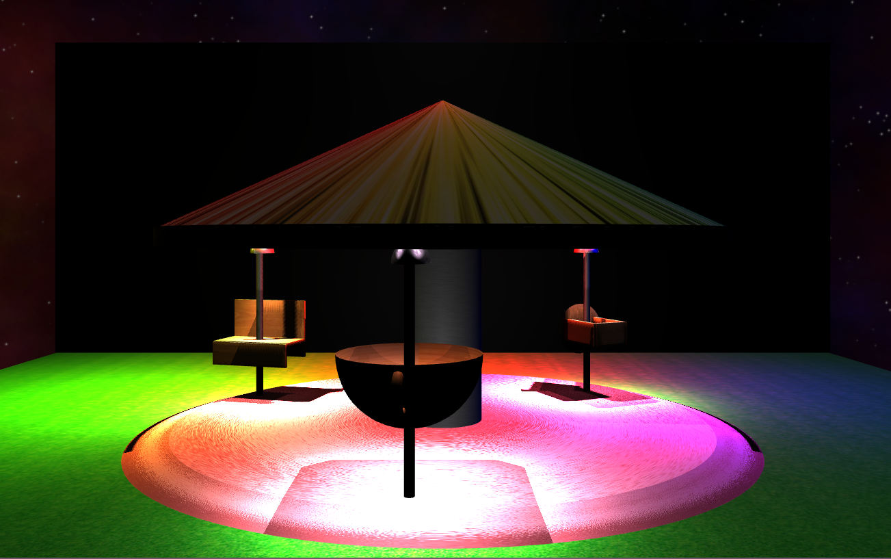

# Proyecto three.js
## Proyecto para la materia Informática 3
### Evelyn Gimenez @ 2021

Requisitos del proyecto: 

    - Crear una calesita
    La calesita debe ser simple.
        Características:
            • Sólo tres juguetes
            • Deberá tener iluminación en el techo de la calesita de forma a iluminar a los juguetes.
            • Deberá tener luces decorativas
            • Deberá girar con una velocidad controlada por el usuario.
            • Los juguetes deberán moverse en forma vertical en su eje
         
* El código se ejecuta a través de Visual Estudio Code - Go Live! 

Vista previa: 

